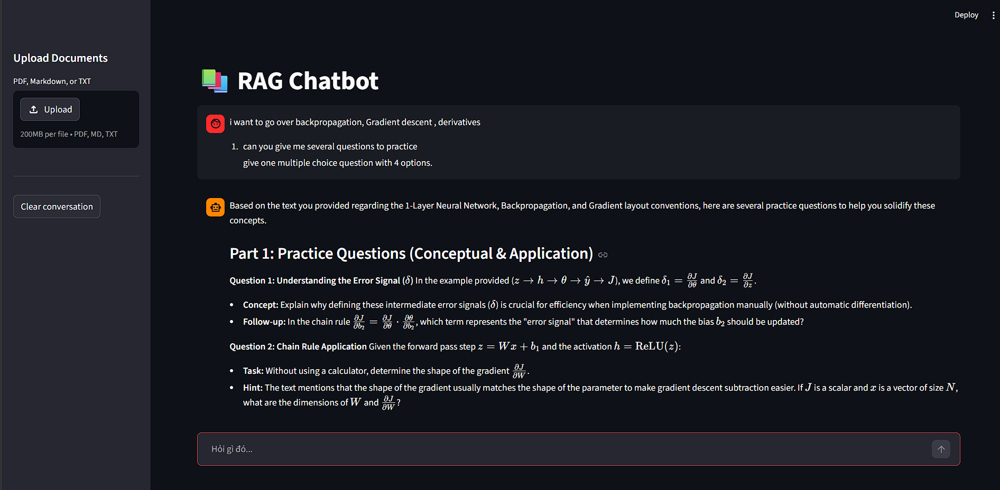
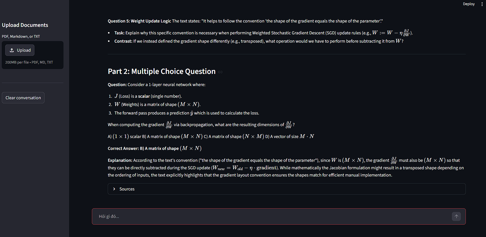

<p align="center">
  <a href="https://www.uit.edu.vn/" title="University of Information Technology" style="border: none;">
    
  </a>
</p>

<h1 align="center"><b>AI Agents Projects - RAG Pipeline</b></h1>

# **Vietnamese RAG Chatbot with LangChain + ChromaDB + Ollama**

A local, privacy-first Retrieval-Augmented Generation (RAG) chatbot for querying personal knowledge bases in Vietnamese. Built on LangChain, ChromaDB, and a locally-running Ollama LLM — no external API calls required after setup.

- **Vietnamese-optimized retrieval** using `intfloat/multilingual-e5-base` with correct query/passage prefixes
- **Dual chunking strategy** — Markdown documents split by header hierarchy, PDFs by recursive character splitting
- **Max Marginal Relevance (MMR)** retrieval for diverse, non-redundant context chunks
- **Multi-turn conversation memory** via `ConversationalRetrievalChain` with a sliding window of the last 5 turns
- **Source citations** shown inline after every answer — file name and section heading

<p align="center">
  
</p>

---

## 👥 Group information

| STT | Student ID | Full Name | Role | Github | Email |
| --- | --- | --- | --- | --- | --- |
| 1 | 23521329 | Nguyễn Văn Quyền | Developer | [quyen244](https://github.com/quyen244) | 23521329@gm.uit.edu.vn |

---

## 📋 Table of Contents

1. [Project Overview](#project-overview)
2. [Key Features](#key-features)
3. [Tech Stack & Architecture](#tech-stack--architecture)
4. [Methodology & Pipeline](#methodology--pipeline)
5. [Project Structure](#project-structure)
6. [Examples](#examples)
7. [Installation & Setup](#installation--setup)
8. [Usage](#usage)
9. [Configuration](#configuration)
10. [References](#references)

---

## Project Overview

Managing personal notes and lecture PDFs in Vietnamese makes standard English-centric RAG solutions a poor fit — most default embedding models perform poorly on Vietnamese text, and typical chunking strategies ignore Markdown structure entirely.

This project builds a fully local RAG chatbot that:
- Accepts Vietnamese PDF and Markdown documents as a knowledge base
- Retrieves semantically relevant chunks using a multilingual embedding model tuned for Vietnamese
- Generates grounded answers via a locally-running `qwen3:4b` model through Ollama
- Maintains conversational context across follow-up questions
- Exposes a clean Streamlit chat UI with document upload and source attribution

---

## Key Features

### Document Ingestion
- **PDF support** via `PyPDFLoader` — preserves page-level metadata for citation
- **Markdown & TXT support** via `TextLoader`
- **Bulk ingestion** through the `ingest.py` CLI script
- **On-the-fly ingestion** via the Streamlit sidebar file uploader (no restart needed)

### Chunking Pipeline
- **Markdown documents**: split first by heading hierarchy (`#`, `##`, `###`) using `MarkdownHeaderTextSplitter`; sections exceeding 512 characters fall back to `RecursiveCharacterTextSplitter`
- **PDFs & plain text**: `RecursiveCharacterTextSplitter` with chunk size 512, overlap 50
- Header metadata is preserved on every chunk for accurate citations

### Retrieval
- **Embedding model**: `intfloat/multilingual-e5-base` with mandatory `"query: "` / `"passage: "` prefixes (required by the E5 model family for correct similarity scores)
- **Vector store**: ChromaDB with SQLite persistence — no separate server needed
- **Search strategy**: Max Marginal Relevance (MMR), fetching 10 candidates and returning the 5 most diverse

### Conversational Chain
- `ConversationalRetrievalChain` reformulates follow-up questions into standalone queries before hitting ChromaDB
- `ConversationBufferWindowMemory` keeps the last 5 conversation turns in context
- `reasoning=False` on the Ollama LLM disables Qwen3's thinking mode for faster responses

### UI
- Streamlit chat interface with `st.chat_message` and `st.chat_input`
- Per-session chain and memory (multiple browser tabs get independent conversations)
- Vectorstore cached across sessions via `@st.cache_resource`
- Collapsible **Sources** expander under each answer showing file name and heading

---

## Tech Stack & Architecture

| Layer | Technology |
|---|---|
| LLM | `qwen3:4b` via [Ollama](https://ollama.com) (local) |
| Embeddings | `intfloat/multilingual-e5-base` via `sentence-transformers` |
| Vector Store | [ChromaDB](https://www.trychroma.com/) (local SQLite persistence) |
| RAG Framework | [LangChain](https://www.langchain.com/) 1.x + `langchain-classic` |
| UI | [Streamlit](https://streamlit.io/) 1.57 |
| PDF Parsing | `pypdf` via `langchain-community` |
| Language | Python 3.14 |

### High-level architecture

```
User Query
    │
    ▼
ConversationalRetrievalChain
    │ reformulates question using chat history
    ▼
MultilingualE5Embeddings  ──►  ChromaDB (MMR, k=5)
                                    │ top-5 chunks
    ┌───────────────────────────────┘
    ▼
ChatOllama (qwen3:4b)
    │ answer + source_documents
    ▼
Streamlit UI  ──►  citations expander
```

---

## Methodology & Pipeline

### 1. Ingestion
```
data/ (PDFs, MDs, TXTs)
    │
    ├── PyPDFLoader       → page-level Documents
    └── TextLoader        → full-file Documents
    │
    ▼
Chunker
    ├── .md  → MarkdownHeaderTextSplitter → RecursiveCharacterTextSplitter (fallback)
    └── rest → RecursiveCharacterTextSplitter (512 tokens, 50 overlap)
    │
    ▼
MultilingualE5Embeddings ("passage: " prefix)
    │
    ▼
ChromaDB (persisted to chroma_db/)
```

### 2. Retrieval & Generation
```
User question
    │
    ▼
Question condenser  (uses chat history to rewrite follow-ups)
    │
    ▼
E5 query embedding ("query: " prefix)
    │
    ▼
ChromaDB MMR search  (fetch_k=10 → return k=5)
    │
    ▼
Prompt: [system] + [retrieved chunks] + [question]
    │
    ▼
qwen3:4b (Ollama, local)
    │
    ▼
Answer + source document metadata → Streamlit
```

### Design decisions
- **E5 prefix handling**: the `MultilingualE5Embeddings` wrapper subclasses `HuggingFaceEmbeddings` and prepends `"passage: "` during indexing and `"query: "` at query time — required for correct cosine similarity scores with this model family.
- **Per-session chain**: the LangChain chain (and its memory) lives in `st.session_state`, so each browser tab has independent conversation history while sharing the same cached vectorstore.
- **MMR over top-k**: reduces retrieving multiple nearly-identical chunks from the same document section, improving answer diversity.

---

## Project Structure

```
RAG/
├── app.py                      # Streamlit entry point
├── ingest.py                   # CLI bulk ingestion script
├── config.py                   # All constants (paths, models, chunk sizes)
├── requirements.txt
├── .env.example                # Copy to .env to override defaults
├── data/                       # Drop your PDFs and Markdown files here
├── chroma_db/                  # Auto-created — ChromaDB persistence
└── src/
    ├── ingestion/
    │   ├── loader.py           # PyPDFLoader + TextLoader wrappers
    │   └── chunker.py          # Dual chunking strategy (MD + recursive)
    ├── retrieval/
    │   ├── embeddings.py       # MultilingualE5Embeddings with E5 prefixes
    │   └── vectorstore.py      # ChromaDB init + MMR retriever factory
    └── chain/
        └── rag_chain.py        # ConversationalRetrievalChain + memory
```

---
## Examples 


## Installation & Setup

### Prerequisites

- Python 3.11+ (tested on 3.14.3)
- [Ollama](https://ollama.com/download) installed and running
- ~2 GB disk space for the embedding model download

### Steps

```powershell
# 1. Clone / navigate to the project
cd "AI Agents Projects\RAG"

# 2. Create and activate virtual environment
python -m venv venv
.\venv\Scripts\activate

# 3. Install dependencies
pip install -r requirements.txt

# 4. Configure environment (optional — defaults work for local Ollama)
cp .env.example .env

# 5. Pull the LLM via Ollama
ollama pull qwen3:4b
```

---

## Usage

### Bulk ingest documents

Drop PDF, Markdown, or TXT files into the `data/` folder, then run:

```powershell
python ingest.py
# or specify a custom directory:
python ingest.py --data-dir path/to/your/docs
```

### Launch the chatbot

```powershell
streamlit run app.py
```

Open `http://localhost:8501` in your browser.

### In the UI

| Action | How |
|---|---|
| Ask a question | Type in the chat input at the bottom |
| Upload new documents | Use the sidebar file uploader → click **Ingest** |
| View sources | Expand the **Sources** section under any answer |
| Reset conversation | Click **Clear conversation** in the sidebar |

---

## Configuration

All tuneable parameters are in `config.py`:

| Variable | Default | Description |
|---|---|---|
| `EMBEDDING_MODEL` | `intfloat/multilingual-e5-base` | HuggingFace embedding model |
| `OLLAMA_MODEL` | `qwen3:4b` | Ollama model tag |
| `OLLAMA_BASE_URL` | `http://localhost:11434` | Overridable via `.env` |
| `CHUNK_SIZE` | `512` | Max characters per chunk |
| `CHUNK_OVERLAP` | `50` | Overlap between consecutive chunks |
| `RETRIEVER_K` | `5` | Chunks returned to the LLM |
| `RETRIEVER_FETCH_K` | `10` | Candidates fetched before MMR re-ranking |
| `MAX_HISTORY_TURNS` | `5` | Conversation turns kept in memory |

---

## References

- [LangChain Documentation](https://docs.langchain.com/)
- [ChromaDB Documentation](https://docs.trychroma.com/)
- [Ollama](https://ollama.com/)
- [intfloat/multilingual-e5-base on HuggingFace](https://huggingface.co/intfloat/multilingual-e5-base)
- [Qwen3 Model Family](https://huggingface.co/Qwen/Qwen3-4B)
- Lewis et al. (2020). *Retrieval-Augmented Generation for Knowledge-Intensive NLP Tasks*. NeurIPS 2020.
